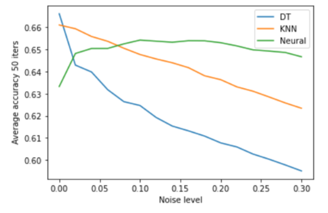

# Noise-effects-on-classifiers
How Noise effects different types of classifiers

<b>Table of Contents:</b>
<b>Libraries Used:</b>
<b>Files Description</b>
<b> Datasets</b>
<b> Results </b>

<b>Libraries Used:</b>
The project was done on Jupyter Notebook and Python 3.0, below are the libraries used:
1. Matplotlib
2. Seaborn
3. Pandas
4. Numpy
5. Sklearn

<b>Dataset:</b>
1. preg: Number of times pregnant
2. plas: Plasma glucose concentration a 2 hours in an oral glucose tolerance test 3. pres: Diastolic blood pressure (mm Hg)
4. skin: Triceps skin fold thickness (mm)
5. insu: 2-Hour serum insulin (mu U/ml)
6. mass: Body mass index (weight in kg/(height in m)^2)
7. pedi: Diabetes pedigree function
8. age: Age (years)
9. class: Class variable (0 or 1)

<b>Domain Background:</b>
The task is to test the diabetes data set, and see how different classifiers get affected when we intentionally add noise to the data set. This should test the robustness of different classifiers. The test is performed on KNN,Decsion Trees (DT) and Neural nets (NN). The noise is added in increments of 2% up to 30%.

<b>Results:</b>
 As seen in the image below, the DT and KNN quickly degraded in prediction power, but NN started low and kept a steady accuracy throughout the increments.
 This should how robust NN are when noise is available in the data set. But then NNs are uninterpretable and require large optimization power

<b>Reflection:</b>

Task 1. KNN (scaled part) was performed for different metrics, and noticed how slow the user defined metric was. Over all the Chebyshev and Manhattan metric performed best and showed a low variance. If the 10 fold simulates noise, then the Manhattan seems the best on average to handle noise.

The Euclidean metric also showed some high scores but on average its had a high variance. I would recommend using the Chebyshev, it seems more reliable on average to handle many folds.

Task 2. The KNN badly and this can be due to the noise, it seems that introducing noise to the data quickly deteriorates the performance of the KNN. As seen from the plot of classifier comparison, the NN held best with the noisy data.

<b>Limitation:</b>

NN become extreme slow, even though it performed well in the noisy data set, but computational performance will be an issue when scaled up, computationally expensive and its black box counter intuitiveness.

DT, clearly seem very sensitive to changes in data, hence the fast drop in performance when increasing the noise (exponential decay).

Possible improvements:

1 To try different metric when running the KNN, and try different hyper parameters. This parameter tunning may help in finding the best metric and K to increase performance. I may prefer the KNN over the NN due to its speed. This is also a small data set, so larger ones will surely have an effect on the business side of things.

2 Some feature selection may help in reducing the size of the data, (looking for relevant features) this will reduce the data set and hence may choose different models, maybe from KNN to NN.
